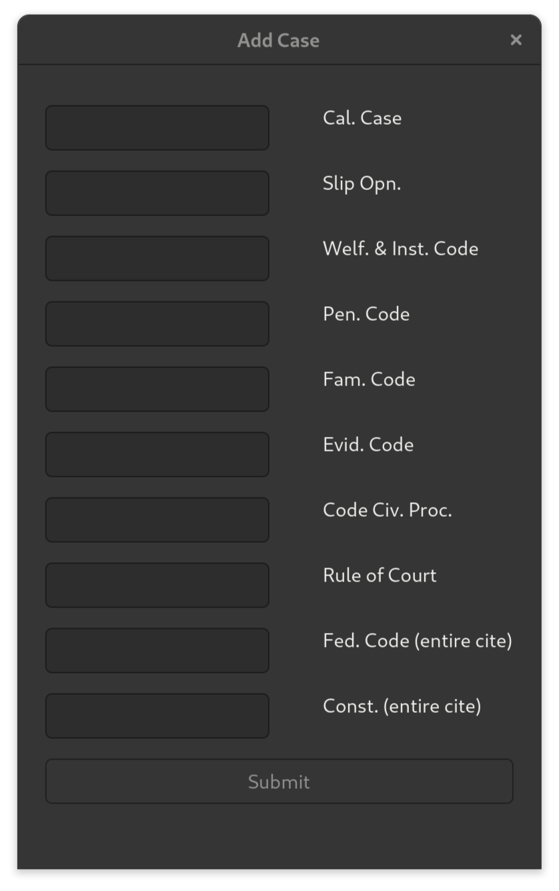
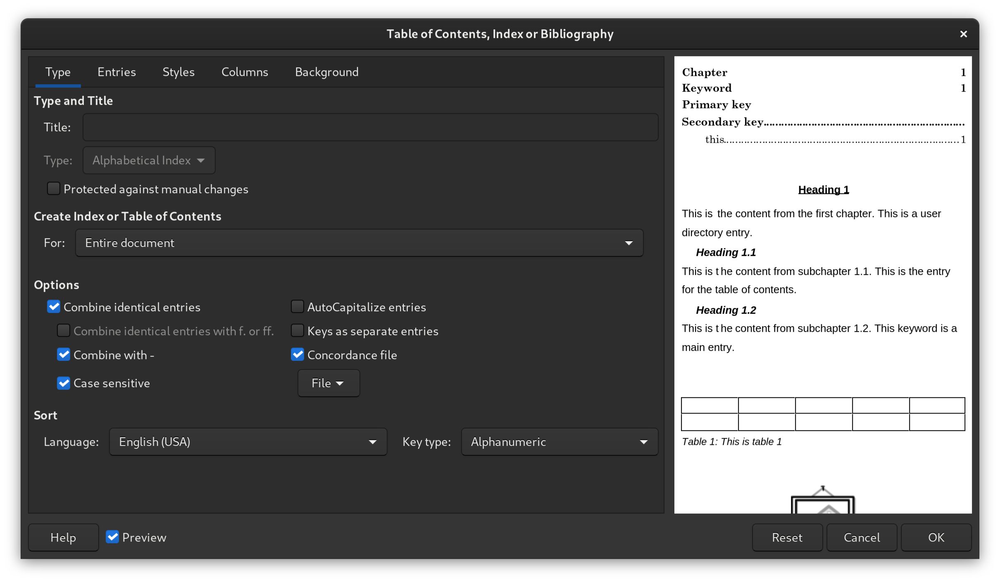

# add-case
App designed to quickly add legal citations to a [concordance file](https://help.libreoffice.org/latest/en-US/text/swriter/01/04120250.html). The concordance file keeps track of words or phrases that a user wants marked as entries for automatically generating a table of authorities. For example, if you input a case citation like, *In re R.F.* (2023) 94 Cal.App.5th 718, that cite will be listed in the table authorities with a page number for every time that it is cited in the brief. The table of authorities will also provide a page number for every time that the shortened version is cited in the brief, *In re R.F., supra,* 94 Cal.App.5th at p. 718.

This app is written in Python and has a GTK4 GUI. It only works on linux. Windows users can use [Windows Subsystem for Linux](https://learn.microsoft.com/en-us/windows/wsl/install).

## Install
Download add case:

	git clone https://github.com/jessemcg/add-case.git
	
Make sure it is executible:

	chmod +x $HOME/add-case/AddCase.py

Run it from the terminal

	python $HOME/add-case/AddCase.py

Or launch the script through a script launching app like the [Launcher](https://extensions.gnome.org/extension/5874/launcher/) extension or [script-handler](https://github.com/jessemcg/script-handler).

# Usage
To automatically generate a table of authorities after a brief as been written with LibreOffice Writer, edit the table of authorities and select the concordance file. The concordance file is located at $HOME/add-case/concordance.sdi. If you move it, just update the concordance file path in the AddCase.py script.

